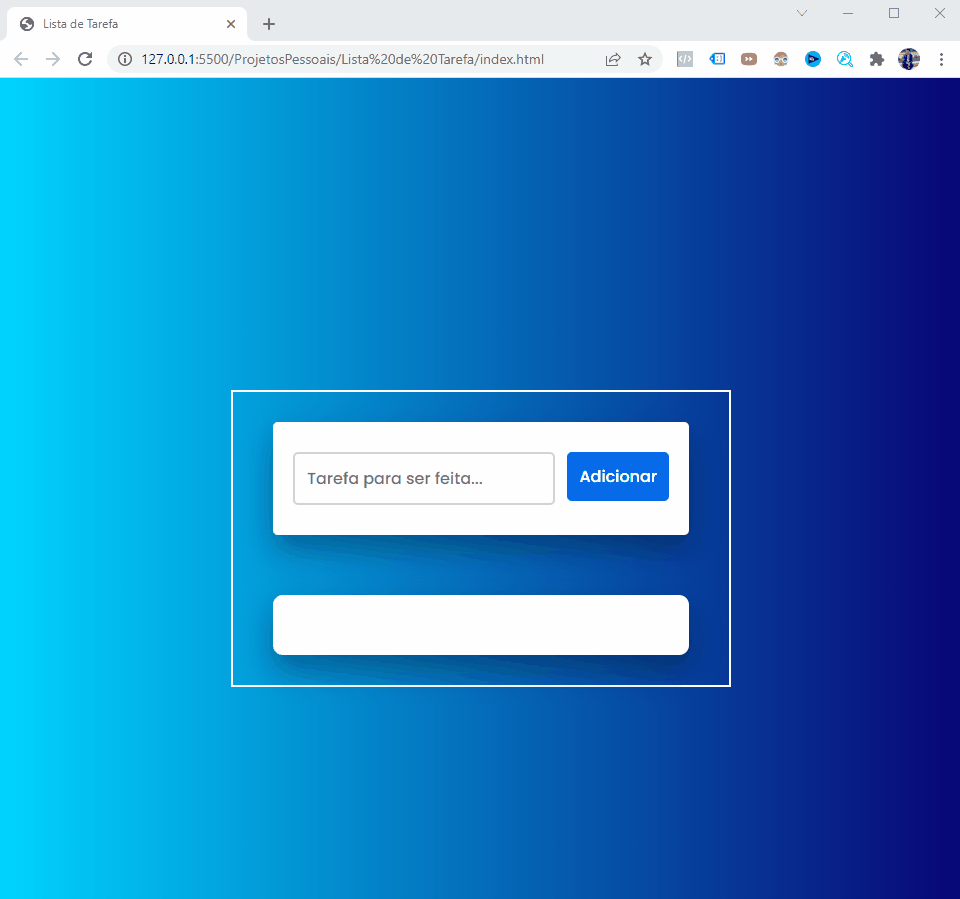

<h1 align="center">Projeto Lista de Tarefa</h1>

 

Lista de tarefa - Criado para organizar mais o dia de serviço e deixar anotado cada tarefa enviada pelo Gestor para concluir. 

Essa aplicação, foi criado o LocalStorage para que as informações não sumam quando atualizar a lista de tarefa. 

Podemos adicionar quantas tarefas necessárias, cada item adicionado será exibido de forma ordenada e irá criar um parágrafo para o item e o botão para deletar a tarefa quando se fizer necessário. 

  

<h1 align="center">
    
</h1>

 

### 🛠 Tecnologias

As seguintes ferramentas foram usadas na construção do Projeto: 

- [JavaScript](https://developer.mozilla.org/pt-BR/docs/Web/JavaScript)
- [VSCode](https://code.visualstudio.com/)
- [HTML](https://developer.mozilla.org/pt-BR/docs/Web/HTML) 
- [CSS](https://developer.mozilla.org/pt-BR/docs/Web/CSS)

---

Feito com 🤩 by Wires Teles 😎 [Veja meu Linkedin](https://www.linkedin.com/in/wires-teles-javascript-dev/)